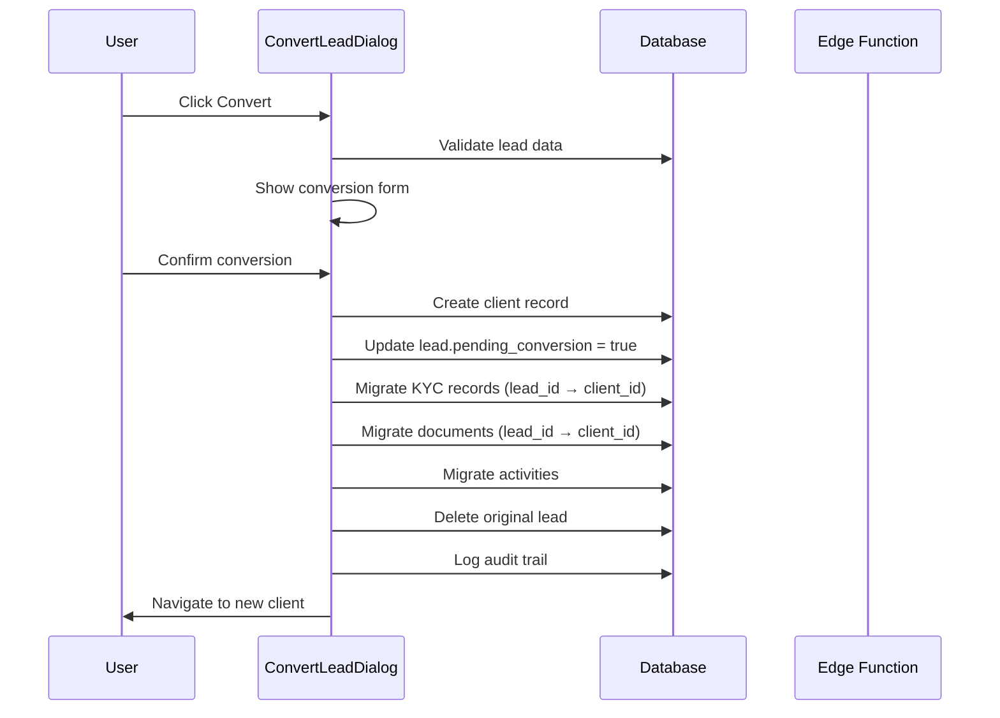
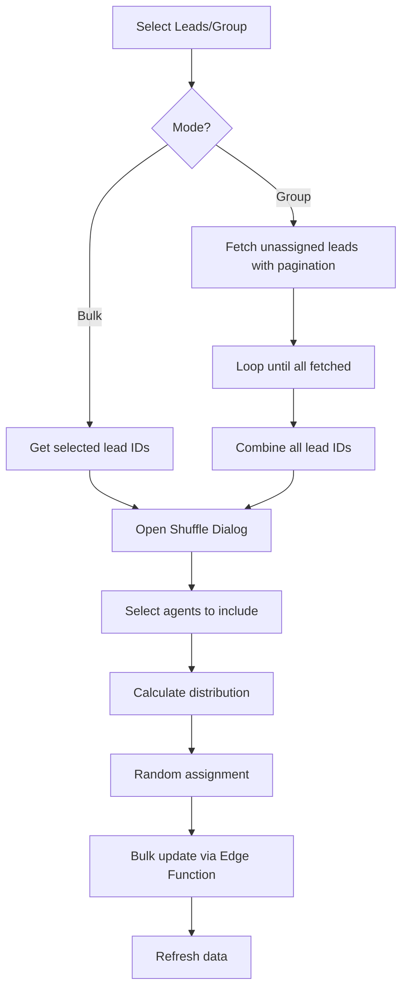

# Leads & Clients Module - Complete Technical Specification

## Overview

This document provides a comprehensive technical specification for the Leads and Clients modules in the Kybalion CRM system. It covers all functionality, workflows, database schemas, RLS policies, hooks, components, and security considerations.

---

## Table of Contents

1. [Architecture Overview](#architecture-overview)
2. [Leads Module](#leads-module)
3. [Clients Module](#clients-module)
4. [Database Schema](#database-schema)
5. [RLS Policies](#rls-policies)
6. [Hooks & State Management](#hooks--state-management)
7. [Components](#components)
8. [Edge Functions](#edge-functions)
9. [Workflows](#workflows)
10. [Security Considerations](#security-considerations)

---

## Architecture Overview

### Multi-Tenant Architecture
Both Leads and Clients operate in a multi-tenant environment where:
- **SUPER_ADMIN**: Can access all tenants
- **TENANT_OWNER**: Owns a tenant, manages all data within their tenant
- **MANAGER**: Manages team members and their data within the tenant
- **SUPER_AGENT**: Senior sales role with extended permissions
- **AGENT**: Basic sales role with limited visibility

### Role Hierarchy
```
SUPER_ADMIN
    └── TENANT_OWNER (admin_id = self)
            └── MANAGER (admin_id = tenant owner)
                    └── SUPER_AGENT (admin_id = tenant owner)
                            └── AGENT (admin_id = tenant owner)
```

### Data Isolation
All records include an `admin_id` field that references the tenant owner, ensuring data isolation between tenants.

---

## Leads Module

### Route & File
- **Route:** `/leads`
- **File:** `src/pages/Leads.tsx`
- **Access:** All authenticated users (filtered by role)

### Features

#### 1. Multi-View Interface
| View | Component | Description |
|------|-----------|-------------|
| Table | `LeadsTableContent.tsx` | Sortable, filterable table with bulk selection |
| Board | `LeadsBoardView.tsx` | Kanban-style board organized by status |
| Groups | `LeadGroupsView.tsx` | Group management interface with shuffle capability |

#### 2. Advanced Filtering
- **Status Filter**: Multi-select from dynamic `lead_statuses` table
- **Country Filter**: Filter by lead country
- **Assigned Agent Filter**: Filter by assigned user
- **Date Range Filter**: Filter by creation date
- **Unassigned Toggle**: Show only unassigned leads
- **Group Filter**: Filter by group membership

#### 3. Bulk Actions
- **Assign**: Bulk assign leads to an agent
- **Delete**: Bulk delete leads (Admin only)
- **Status Update**: Bulk update lead status
- **Add to Group**: Add leads to existing group
- **Move to Group**: Remove from current group and add to new group
- **Shuffle**: Random distribution among agents

#### 4. Shuffle Assignment
The shuffle feature supports two modes:
- **Bulk Shuffle**: Shuffle selected leads from table
- **Group Shuffle**: Shuffle all unassigned leads in a group

**Group Shuffle Implementation (handles 1000+ leads):**
```typescript
const handleShuffleGroup = async (groupId: string) => {
  let allUnassignedLeadIds: string[] = [];
  let hasMore = true;
  let offset = 0;
  const batchSize = 1000;

  while (hasMore) {
    const { data, error } = await supabase
      .from("lead_group_members")
      .select("lead_id, leads!inner(id, assigned_to)")
      .eq("group_id", groupId)
      .is("leads.assigned_to", null) // Filter at database level
      .range(offset, offset + batchSize - 1);

    if (error) return;

    const leadIds = data.map((m) => m.lead_id);
    allUnassignedLeadIds = [...allUnassignedLeadIds, ...leadIds];
    
    hasMore = leadIds.length === batchSize;
    offset += batchSize;
  }
  // Open shuffle dialog with all unassigned leads
};
```

#### 5. Import/Export
- **Export**: CSV export with KYC data (banks, notes)
- **Import**: CSV import with duplicate detection (email/phone)
- **Template**: Download empty CSV template

#### 6. Lead Actions
| Action | Description | Conditions |
|--------|-------------|------------|
| Call | Initiate call via CCC integration | CCC enabled + credentials |
| Email | Send email via email integration | Email integration active |
| Add Bank | Add KYC bank record | Always available |
| Add Note | Add KYC note | Always available |
| Convert | Convert lead to client | SUPER_ADMIN, TENANT_OWNER, MANAGER |
| Create Account | External account creation | Placeholder for integration |

### State Management

```typescript
// View and filter state
const [viewMode, setViewMode] = useState<"table" | "board" | "groups">("table");
const [search, setSearch] = useState("");
const [selectedStatuses, setSelectedStatuses] = useState<LeadStatus[]>([]);
const [filterValues, setFilterValues] = useState<FilterValues>({
  assignedTo: [],
  country: [],
  groupIds: [],
  createdAt: null,
  unassigned: false,
});

// Server-side pagination
const [currentPage, setCurrentPage] = useState(1);
const [pageSize, setPageSize] = useState<number>(5000); // Max page size

// Selection state
const [selectedLeads, setSelectedLeads] = useState<string[]>([]);

// Shuffle state
const [shuffleDialogOpen, setShuffleDialogOpen] = useState(false);
const [shuffleMode, setShuffleMode] = useState<"bulk" | "group">("bulk");
const [shuffleGroupId, setShuffleGroupId] = useState<string | undefined>();
const [shuffleLeadIds, setShuffleLeadIds] = useState<string[]>([]);
```

---

## Clients Module

### Route & File
- **Route:** `/clients`
- **File:** `src/pages/Clients.tsx`
- **Access:** All authenticated users (filtered by role)

### Features

#### 1. Dual View Interface
| View | Component | Description |
|------|-----------|-------------|
| Table | `ClientsTableView.tsx` | Sortable table with deposit highlighting |
| Board | `ClientsBoardView.tsx` | Kanban-style board by status |

#### 2. Default Sorting
Clients default to `updated_at DESC` (last modified first) to prioritize active accounts.

#### 3. Statistics Cards
- **Total Clients**: Count of all visible clients
- **Total Balance**: Sum of all client balances
- **Total Initial Amount**: Sum of all client equity

#### 4. Deposit Highlighting
Clients with deposits are visually highlighted:
```tsx
<TableRow
  className={cn(
    "cursor-pointer hover:bg-muted/50",
    hasDeposit && "border-l-4 border-l-green-500 bg-green-500/5"
  )}
/>
```

#### 5. Filtering
- **Status Filter**: Multi-select from dynamic `client_statuses` table
- **Country Filter**: Filter by client country
- **Assigned Agent Filter**: Filter by assigned user
- **Group Filter**: Filter by group membership
- **Has Deposited Filter**: Filter clients with/without deposits

#### 6. Bulk Actions
- **Assign**: Bulk assign clients to an agent
- **Delete**: Bulk delete clients (Admin only)
- **Status Update**: Bulk update client status
- **Assign to Group**: Add clients to a group

#### 7. Import/Export
- **Export**: CSV export with KYC data and group info
- **Import**: CSV import with validation

#### 8. Client Actions
| Action | Description | Conditions |
|--------|-------------|------------|
| Call | Initiate call via CCC integration | CCC enabled + credentials |
| Email | Send email via email integration | Email integration active |
| Add Bank | Add KYC bank record | Always available |
| Add Note | Add KYC note | Always available |
| Create Account | External account creation | Placeholder |

### State Management

```typescript
// View and filter state
const [viewMode, setViewMode] = useState<"table" | "board">("table");
const [search, setSearch] = useState("");
const [selectedStatuses, setSelectedStatuses] = useState<ClientStatus[]>([]);
const [filterValues, setFilterValues] = useState<ClientFilterValues>({
  assignedTo: [],
  country: [],
  tenant: [],
  group: [],
  hasDeposited: undefined,
});

// Server-side pagination
const [currentPage, setCurrentPage] = useState(1);
const [pageSize, setPageSize] = useState<number>(25);

// Sorting state (defaults to updated_at desc)
const { sort, handleSort } = useTableSort('updated_at', 'desc');

// Selection state
const [selectedClients, setSelectedClients] = useState<string[]>([]);
```

---

## Database Schema

### Leads Table

```sql
CREATE TABLE public.leads (
  id uuid PRIMARY KEY DEFAULT gen_random_uuid(),
  seq_id bigint NOT NULL GENERATED ALWAYS AS IDENTITY,
  name text NOT NULL,
  email text,
  phone text,
  country text,
  source lead_source NOT NULL DEFAULT 'OTHER',
  status text NOT NULL DEFAULT 'NEW',
  job_title text,
  company text,
  assigned_to uuid REFERENCES profiles(id),
  conversion_probability numeric DEFAULT 0.00,
  estimated_close_date date,
  best_contact_time text,
  next_best_action text,
  is_transferred boolean DEFAULT false,
  pending_conversion boolean DEFAULT false,
  last_contacted_at timestamptz,
  balance numeric DEFAULT 0.00,
  equity numeric DEFAULT 0.00,
  position integer DEFAULT 0,
  created_by uuid NOT NULL REFERENCES profiles(id),
  admin_id uuid REFERENCES profiles(id),
  created_at timestamptz NOT NULL DEFAULT now(),
  updated_at timestamptz NOT NULL DEFAULT now()
);

-- Lead source enum
CREATE TYPE lead_source AS ENUM (
  'WEBSITE', 'REFERRAL', 'SOCIAL_MEDIA', 'COLD_CALL',
  'EMAIL_CAMPAIGN', 'PAID_ADS', 'WEBINAR', 'TRADE_SHOW', 'OTHER'
);
```

### Lead Groups

```sql
CREATE TABLE public.lead_groups (
  id uuid PRIMARY KEY DEFAULT gen_random_uuid(),
  name text NOT NULL,
  description text,
  created_by uuid NOT NULL REFERENCES profiles(id),
  admin_id uuid REFERENCES profiles(id),
  created_at timestamptz NOT NULL DEFAULT now(),
  updated_at timestamptz NOT NULL DEFAULT now()
);

CREATE TABLE public.lead_group_members (
  id uuid PRIMARY KEY DEFAULT gen_random_uuid(),
  group_id uuid NOT NULL REFERENCES lead_groups(id) ON DELETE CASCADE,
  lead_id uuid NOT NULL REFERENCES leads(id) ON DELETE CASCADE,
  added_by uuid REFERENCES profiles(id),
  added_at timestamptz NOT NULL DEFAULT now(),
  UNIQUE(group_id, lead_id)
);
```

### Lead Statuses

```sql
CREATE TABLE public.lead_statuses (
  id uuid PRIMARY KEY DEFAULT gen_random_uuid(),
  name text NOT NULL UNIQUE,
  color text DEFAULT '#6366f1',
  position integer DEFAULT 0,
  is_default boolean DEFAULT false,
  is_active boolean DEFAULT true,
  created_at timestamptz NOT NULL DEFAULT now(),
  updated_at timestamptz NOT NULL DEFAULT now()
);
```

### Clients Table

```sql
CREATE TABLE public.clients (
  id uuid PRIMARY KEY DEFAULT gen_random_uuid(),
  seq_id bigint NOT NULL GENERATED ALWAYS AS IDENTITY,
  name text NOT NULL,
  email text,
  home_phone text,
  country text,
  source lead_source,
  status text NOT NULL DEFAULT 'ACTIVE',
  balance numeric DEFAULT 0,
  equity numeric DEFAULT 0,
  open_trades integer DEFAULT 0,
  deposits numeric DEFAULT 0,
  pipeline_status pipeline_status DEFAULT 'PROSPECT',
  potential_value numeric,
  actual_value numeric,
  kyc_status kyc_status DEFAULT 'PENDING',
  margin_level numeric,
  satisfaction_score numeric,
  assigned_to uuid REFERENCES profiles(id),
  transferring_agent uuid REFERENCES profiles(id),
  conversion_manager_id uuid REFERENCES profiles(id),
  converted_from_lead_id uuid,
  join_date date NOT NULL DEFAULT CURRENT_DATE,
  created_by uuid NOT NULL REFERENCES profiles(id),
  admin_id uuid REFERENCES profiles(id),
  created_at timestamptz NOT NULL DEFAULT now(),
  updated_at timestamptz NOT NULL DEFAULT now()
);

-- Pipeline status enum
CREATE TYPE pipeline_status AS ENUM (
  'PROSPECT', 'QUALIFIED', 'NEGOTIATION', 'CLOSED_WON', 'CLOSED_LOST'
);

-- KYC status enum
CREATE TYPE kyc_status AS ENUM ('PENDING', 'VERIFIED', 'REJECTED');
```

### Client Groups

```sql
CREATE TABLE public.client_groups (
  id uuid PRIMARY KEY DEFAULT gen_random_uuid(),
  name text NOT NULL,
  description text,
  is_system boolean DEFAULT false,
  created_by uuid REFERENCES profiles(id),
  admin_id uuid REFERENCES profiles(id),
  created_at timestamptz NOT NULL DEFAULT now(),
  updated_at timestamptz NOT NULL DEFAULT now()
);

CREATE TABLE public.client_group_members (
  id uuid PRIMARY KEY DEFAULT gen_random_uuid(),
  group_id uuid NOT NULL REFERENCES client_groups(id) ON DELETE CASCADE,
  client_id uuid NOT NULL REFERENCES clients(id) ON DELETE CASCADE,
  added_by uuid REFERENCES profiles(id),
  added_at timestamptz NOT NULL DEFAULT now(),
  UNIQUE(group_id, client_id)
);
```

### KYC Records

```sql
CREATE TABLE public.kyc_records (
  id uuid PRIMARY KEY DEFAULT gen_random_uuid(),
  lead_id uuid REFERENCES leads(id) ON DELETE CASCADE,
  client_id uuid REFERENCES clients(id) ON DELETE CASCADE,
  bank_name text,
  notes text,
  status kyc_status DEFAULT 'PENDING',
  verified_by uuid REFERENCES profiles(id),
  verified_date timestamptz,
  created_by uuid NOT NULL REFERENCES profiles(id),
  admin_id uuid REFERENCES profiles(id),
  created_at timestamptz NOT NULL DEFAULT now(),
  updated_at timestamptz NOT NULL DEFAULT now(),
  CHECK (lead_id IS NOT NULL OR client_id IS NOT NULL)
);
```

### Documents

```sql
CREATE TABLE public.documents (
  id uuid PRIMARY KEY DEFAULT gen_random_uuid(),
  name text NOT NULL,
  file_path text NOT NULL,
  size bigint NOT NULL,
  type document_type NOT NULL,
  lead_id uuid REFERENCES leads(id) ON DELETE CASCADE,
  client_id uuid REFERENCES clients(id) ON DELETE CASCADE,
  kyc_record_id uuid REFERENCES kyc_records(id) ON DELETE CASCADE,
  uploaded_by uuid NOT NULL REFERENCES profiles(id),
  admin_id uuid REFERENCES profiles(id),
  created_at timestamptz NOT NULL DEFAULT now()
);

CREATE TYPE document_type AS ENUM (
  'ID_CARD', 'PASSPORT', 'DRIVERS_LICENSE', 'UTILITY_BILL',
  'BANK_STATEMENT', 'CONTRACT', 'OTHER'
);
```

---

## RLS Policies

### Leads Table

```sql
-- SELECT: Role-based visibility
CREATE POLICY "leads_select_policy" ON leads FOR SELECT USING (
  EXISTS (
    SELECT 1 FROM user_roles ur
    WHERE ur.user_id = auth.uid() AND (
      -- SUPER_ADMIN: All leads
      ur.role = 'SUPER_ADMIN' OR
      -- TENANT_OWNER/MANAGER/ADMIN: Same tenant
      (ur.role IN ('TENANT_OWNER', 'MANAGER', 'ADMIN') AND 
       leads.admin_id = (SELECT admin_id FROM profiles WHERE id = auth.uid())) OR
      -- TENANT_OWNER: Own tenant
      (ur.role = 'TENANT_OWNER' AND leads.admin_id = auth.uid()) OR
      -- AGENT/SUPER_AGENT: Assigned or created by
      (ur.role IN ('AGENT', 'SUPER_AGENT') AND 
       (leads.assigned_to = auth.uid() OR leads.created_by = auth.uid()))
    )
  )
);

-- INSERT: All authenticated users
CREATE POLICY "leads_insert_policy" ON leads FOR INSERT WITH CHECK (true);

-- UPDATE: Admins or assigned/created by
CREATE POLICY "leads_update_policy" ON leads FOR UPDATE USING (
  EXISTS (
    SELECT 1 FROM user_roles ur
    WHERE ur.user_id = auth.uid() AND (
      ur.role IN ('SUPER_ADMIN', 'TENANT_OWNER', 'MANAGER', 'ADMIN') OR
      leads.assigned_to = auth.uid() OR
      leads.created_by = auth.uid()
    )
  )
);

-- DELETE: Admins only
CREATE POLICY "leads_delete_policy" ON leads FOR DELETE USING (
  EXISTS (
    SELECT 1 FROM user_roles ur
    WHERE ur.user_id = auth.uid() AND 
          ur.role IN ('SUPER_ADMIN', 'TENANT_OWNER', 'MANAGER', 'ADMIN')
  )
);
```

### Clients Table (via clients_secure view)

The `clients_secure` view applies additional masking for phone/email based on role settings:

```sql
-- View that masks sensitive data based on role
CREATE VIEW clients_secure AS
SELECT 
  c.*,
  CASE 
    WHEN can_view_phone(auth.uid()) THEN c.home_phone
    ELSE mask_phone(c.home_phone)
  END as home_phone,
  CASE 
    WHEN can_view_email(auth.uid()) THEN c.email
    ELSE mask_email(c.email)
  END as email
FROM clients c
WHERE can_access_tenant(c.admin_id);
```

### Lead Groups

```sql
-- SELECT: Tenant access
CREATE POLICY "Users can view groups in their tenant" ON lead_groups FOR SELECT
USING (can_access_tenant(admin_id));

-- INSERT: Admins and managers
CREATE POLICY "Authorized users can create groups" ON lead_groups FOR INSERT
WITH CHECK (
  auth.uid() = created_by AND 
  has_role(auth.uid(), 'SUPER_ADMIN') OR 
  has_role(auth.uid(), 'TENANT_OWNER') OR 
  has_role(auth.uid(), 'MANAGER')
);

-- UPDATE: Admins, managers, or creator
CREATE POLICY "Authorized users can update groups" ON lead_groups FOR UPDATE
USING (
  has_role(auth.uid(), 'SUPER_ADMIN') OR
  (has_role(auth.uid(), 'TENANT_OWNER') OR has_role(auth.uid(), 'MANAGER')) AND
  (admin_id = auth.uid() OR created_by = auth.uid() OR can_access_tenant(admin_id))
);

-- DELETE: Same as update
CREATE POLICY "Authorized users can delete groups" ON lead_groups FOR DELETE
USING (
  has_role(auth.uid(), 'SUPER_ADMIN') OR
  (has_role(auth.uid(), 'TENANT_OWNER') OR has_role(auth.uid(), 'MANAGER')) AND
  (admin_id = auth.uid() OR created_by = auth.uid() OR can_access_tenant(admin_id))
);
```

### Helper Functions

```sql
-- Check if user has a specific role
CREATE FUNCTION has_role(_user_id uuid, _role app_role)
RETURNS boolean
LANGUAGE sql STABLE SECURITY DEFINER
SET search_path = public
AS $$
  SELECT EXISTS (
    SELECT 1 FROM user_roles
    WHERE user_id = _user_id AND role = _role
  )
$$;

-- Check if user can access tenant
CREATE FUNCTION can_access_tenant(_admin_id uuid)
RETURNS boolean
LANGUAGE sql STABLE SECURITY DEFINER
SET search_path = public
AS $$
  SELECT 
    has_role(auth.uid(), 'SUPER_ADMIN') OR
    auth.uid() = _admin_id OR
    (SELECT admin_id FROM profiles WHERE id = auth.uid()) = _admin_id
$$;

-- Get user role directly (for performance)
CREATE FUNCTION get_user_role_direct(_user_id uuid)
RETURNS text
LANGUAGE sql STABLE SECURITY DEFINER
AS $$
  SELECT role::text FROM user_roles WHERE user_id = _user_id LIMIT 1
$$;
```

---

## Hooks & State Management

### useLeadsPaginated

```typescript
const useLeadsPaginated = (
  filters: {
    search?: string;
    statuses?: string[];
    assignedToList?: string[];
    unassigned?: boolean;
    countries?: string[];
    groupIds?: string[];
    dateFrom?: string;
    dateTo?: string;
    teamMemberIds?: string[];
  },
  pagination: { page: number; pageSize: number },
  enabled?: boolean
) => {
  // Returns:
  return {
    leads: Lead[],
    totalCount: number,
    isLoading: boolean,
    error: Error | null,
    updateLead: UseMutationResult,
    bulkDeleteLeads: UseMutationResult,
    bulkUpdateLeadStatus: UseMutationResult,
    pagination: {
      currentPage: number,
      totalPages: number,
      pageSize: number,
      totalCount: number
    }
  };
};
```

### useClientsPaginated

```typescript
const useClientsPaginated = (
  filters: {
    search?: string;
    statuses?: string[];
    assignedToList?: string[];
    countries?: string[];
    teamMemberIds?: string[];
    groupIds?: string[];
    hasDeposited?: boolean;
  },
  pagination: { page: number; pageSize: number }
) => {
  // Returns:
  return {
    clients: Client[],
    totalCount: number,
    isLoading: boolean,
    pagination: PaginationInfo,
    bulkUpdateStatus: UseMutationResult,
    bulkDeleteClients: UseMutationResult,
    depositedClientIds: Set<string>
  };
};
```

### useLeadActions

```typescript
const useLeadActions = (userId?: string) => {
  // Returns:
  return {
    // Dialog states
    showBankDialog: boolean,
    setShowBankDialog: (open: boolean) => void,
    showNoteDialog: boolean,
    setShowNoteDialog: (open: boolean) => void,
    convertDialogOpen: boolean,
    setConvertDialogOpen: (open: boolean) => void,
    emailDialogOpen: boolean,
    setEmailDialogOpen: (open: boolean) => void,
    
    // Selected entities
    selectedLeadForAction: Lead | null,
    leadToConvert: Lead | null,
    emailRecipient: { email: string; name: string },
    
    // Handlers
    handleAddBank: (lead: Lead) => void,
    handleAddNote: (lead: Lead) => void,
    handleCall: (lead: Lead) => Promise<void>,
    handleSendEmail: (lead: Lead) => void,
    handleCreateAccount: (lead: Lead) => void,
    handleConvert: (lead: Lead) => void,
  };
};
```

### useClientActions

```typescript
const useClientActions = () => {
  // Returns:
  return {
    // Dialog states
    showBankDialog: boolean,
    setShowBankDialog: (open: boolean) => void,
    showNoteDialog: boolean,
    setShowNoteDialog: (open: boolean) => void,
    emailDialogOpen: boolean,
    setEmailDialogOpen: (open: boolean) => void,
    
    // Selected entity
    selectedClient: Client | null,
    emailRecipient: { email: string; name: string },
    
    // Handlers
    handleAddBank: (client: Client) => void,
    handleAddNote: (client: Client) => void,
    handleCall: (client: Client) => Promise<void>,
    handleSendEmail: (client: Client) => void,
    handleCreateAccount: (client: Client) => void,
  };
};
```

---

## Components

### Leads Components

| Component | Path | Description |
|-----------|------|-------------|
| `LeadsTableToolbar` | `src/components/leads/LeadsTableToolbar.tsx` | Search, view toggle, export/import buttons |
| `LeadsTableFilters` | `src/components/leads/LeadsTableToolbar.tsx` | Status, country, agent, date filters |
| `LeadsTableContent` | `src/components/leads/LeadsTableContent.tsx` | Table rows with selection, sorting |
| `LeadsBoardView` | `src/components/leads/LeadsBoardView.tsx` | Kanban board by status |
| `LeadGroupsView` | `src/components/leads/LeadGroupsView.tsx` | Group cards with shuffle |
| `LeadStatusDropdown` | `src/components/leads/LeadStatusDropdown.tsx` | Inline status change |
| `LeadAssignmentDropdown` | `src/components/leads/LeadAssignmentDropdown.tsx` | Inline agent assignment |
| `LeadRowActions` | `src/components/leads/LeadRowActions.tsx` | Action menu (call, email, bank, note, convert) |
| `LeadsFloatingBar` | `src/components/leads/LeadsFloatingBar.tsx` | Bulk action bar |
| `CreateLeadDialog` | `src/components/leads/CreateLeadDialog.tsx` | New lead form |
| `ImportLeadsDialog` | `src/components/leads/ImportLeadsDialog.tsx` | CSV import |
| `ConvertLeadDialog` | `src/components/leads/ConvertLeadDialog.tsx` | Convert to client |
| `AssignGroupDialog` | `src/components/leads/AssignGroupDialog.tsx` | Assign/move to group |
| `ShuffleAssigneeDialog` | `src/components/leads/ShuffleAssigneeDialog.tsx` | Random assignment |
| `LeadKYCNotes` | `src/components/leads/LeadKYCNotes.tsx` | Inline KYC preview |

### Clients Components

| Component | Path | Description |
|-----------|------|-------------|
| `ClientsTableToolbar` | `src/components/clients/ClientsTableToolbar.tsx` | Search, view toggle, export/import buttons |
| `ClientsTableFilters` | `src/components/clients/ClientsTableFilters.tsx` | Status, country, agent, group filters |
| `ClientsTableView` | `src/components/clients/ClientsTableView.tsx` | Table with deposit highlighting |
| `ClientsBoardView` | `src/components/clients/ClientsBoardView.tsx` | Kanban board by status |
| `ClientStatusDropdown` | `src/components/clients/ClientStatusDropdown.tsx` | Inline status change |
| `ClientRowActions` | `src/components/clients/ClientRowActions.tsx` | Action menu |
| `ClientsFloatingBar` | `src/components/clients/ClientsFloatingBar.tsx` | Bulk action bar |
| `CreateClientDialog` | `src/components/clients/CreateClientDialog.tsx` | New client form |
| `ImportClientsDialog` | `src/components/clients/ImportClientsDialog.tsx` | CSV import |
| `BulkAssignClientsDialog` | `src/components/clients/BulkAssignClientsDialog.tsx` | Bulk agent assignment |
| `AssignClientGroupDialog` | `src/components/clients/AssignClientGroupDialog.tsx` | Group assignment |
| `ClientKYCNotes` | `src/components/clients/ClientKYCNotes.tsx` | Inline KYC preview |

---

## Edge Functions

### Bulk Operations

| Function | Path | Description |
|----------|------|-------------|
| `bulk-assign-leads` | `supabase/functions/bulk-assign-leads/index.ts` | Assign leads to agent |
| `bulk-delete-leads` | `supabase/functions/bulk-delete-leads/index.ts` | Delete multiple leads |
| `bulk-update-lead-status` | `supabase/functions/bulk-update-lead-status/index.ts` | Update lead statuses |
| `bulk-assign-clients` | `supabase/functions/bulk-assign-clients/index.ts` | Assign clients to agent |
| `bulk-delete-clients` | `supabase/functions/bulk-delete-clients/index.ts` | Delete multiple clients |
| `bulk-update-client-status` | `supabase/functions/bulk-update-client-status/index.ts` | Update client statuses |

### Call Integration

| Function | Path | Description |
|----------|------|-------------|
| `initiate-call` | `supabase/functions/initiate-call/index.ts` | Start call via CCC |
| `hangup-call` | `supabase/functions/hangup-call/index.ts` | End active call |
| `call-control` | `supabase/functions/call-control/index.ts` | Mute/hold operations |
| `call-webhook` | `supabase/functions/call-webhook/index.ts` | CCC callback handler |

### Email Integration

| Function | Path | Description |
|----------|------|-------------|
| `send-email` | `supabase/functions/send-email/index.ts` | Send email via Resend |

---

## Workflows

### Lead to Client Conversion



### Shuffle Assignment



### Visibility Controls

```typescript
// Phone visibility
const shouldShowPhone = isSuperAdmin || isTenantOwner || isManager || 
  (isSuperAgent && settings?.show_phone_to_super_agents) ||
  (isAgent && settings?.show_phone_to_agents);

// Email visibility
const shouldShowEmail = isSuperAdmin || isTenantOwner || isManager ||
  (isSuperAgent && settings?.show_email_to_super_agents) ||
  (isAgent && settings?.show_email_to_agents);
```

---

## Security Considerations

### 1. Role-Based Access Control (RBAC)
- All access controlled via `user_roles` table
- Roles stored in separate table (not in profiles) to prevent privilege escalation
- Helper functions use `SECURITY DEFINER` to avoid RLS recursion

### 2. Multi-Tenant Isolation
- All records include `admin_id` referencing tenant owner
- `can_access_tenant()` function validates access
- Super admins bypass tenant restrictions

### 3. Data Masking
- Phone/email masked based on role settings
- `clients_secure` view handles masking transparently
- Settings configurable per tenant

### 4. Audit Logging
- All mutations logged to `audit_logs` table
- Includes user_id, entity_type, entity_id, action, changes
- IP address and user agent captured when available

### 5. Bulk Operation Safety
- Bulk operations use Edge Functions (server-side)
- Prevents UI timeout on large operations
- Debounced realtime subscriptions prevent UI thrashing

### 6. Query Limits
- Supabase default limit: 1000 rows
- Pagination implemented to handle large datasets
- Group shuffle uses batched fetching (1000 at a time)

---

## TypeScript Types

### Lead Type

```typescript
interface Lead {
  id: string;
  name: string;
  email: string;
  phone?: string;
  country?: string;
  source: LeadSource;
  status: LeadStatus;
  job_title?: string;
  company?: string;
  assigned_to?: string;
  estimated_close_date?: string;
  best_contact_time?: string;
  is_transferred: boolean;
  pending_conversion: boolean;
  last_contacted_at?: string;
  created_by: string;
  created_at: string;
  updated_at: string;
  position?: number;
  admin_id?: string;
  balance?: number;
  equity?: number;
}

type LeadSource = 
  | 'WEBSITE' | 'REFERRAL' | 'SOCIAL_MEDIA' | 'COLD_CALL'
  | 'EMAIL_CAMPAIGN' | 'PAID_ADS' | 'WEBINAR' | 'TRADE_SHOW' | 'OTHER';

type LeadStatus = string; // Dynamic from database
```

### Client Type

```typescript
interface Client {
  id: string;
  name: string;
  email: string;
  country?: string;
  home_phone?: string;
  join_date: string;
  source?: LeadSource;
  balance: number;
  equity: number;
  open_trades: number;
  deposits: number;
  status: ClientStatus;
  assigned_to?: string;
  pipeline_status: PipelineStatus;
  potential_value?: number;
  actual_value?: number;
  converted_from_lead_id?: string;
  created_by: string;
  created_at: string;
  updated_at: string;
  admin_id?: string;
  transferring_agent?: string;
  kyc_status?: KYCStatus;
}

type ClientStatus = string; // Dynamic from database
type PipelineStatus = 'PROSPECT' | 'QUALIFIED' | 'NEGOTIATION' | 'CLOSED_WON' | 'CLOSED_LOST';
type KYCStatus = 'PENDING' | 'VERIFIED' | 'REJECTED';
```

---

## Performance Optimizations

1. **Server-side Pagination**: All list queries use `.range()` for pagination
2. **Debounced Realtime**: Updates batched with 200ms debounce
3. **Optimistic Updates**: UI updates immediately, reverts on error
4. **Memoized Sorting**: `useMemo` for expensive sort operations
5. **Conditional Queries**: Queries disabled until required data ready
6. **Bulk Operation Flags**: Realtime skipped during bulk operations

---

## Related Documentation

- `docs/application-documentation.md` - Full application documentation
- `docs/rls-policies-ai-prompt.md` - Detailed RLS policy reference
- `docs/edge-functions-complete-code.md` - Edge function implementations
- `docs/database-ai-prompt.md` - Database schema reference
